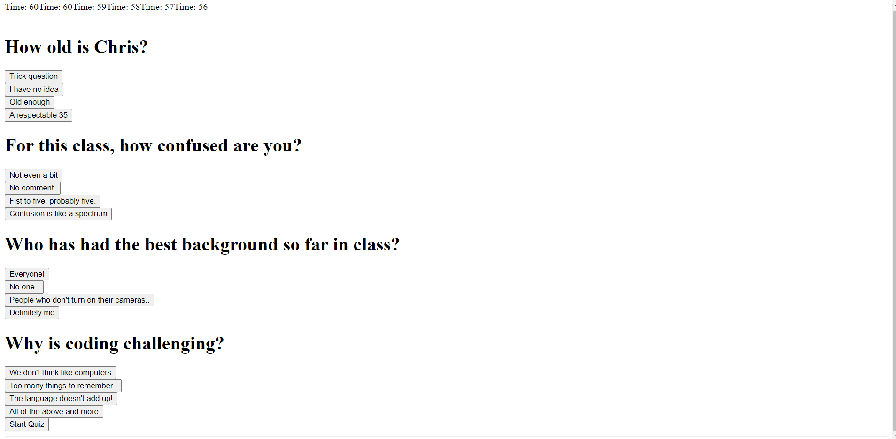

# HW-4-Quiz-Game

# Purpose

The purpose of this project was to create a quiz game that included questions, multiple choice answers, a timer, getting to save score, and getting to view the highest scores.

# What I Learned

## HTML

For HTML, I learned that it doesn't have to have a lot of elements to accomplish what we need to do. At first, I started with organizing the rows and columns with Bootstrap. However, that just confused me. It did make it look more organized however.

## CSS

Unfortunately, I didn't get to make it to CSS. Figuring out the JS took up most of my time.

## JS

I feel like a lot of my time was spent wasted on figuring out why my code wasn't working because the logic was flawed. In part, the logic was flawed. However, I spent too much thinking about how the logic was flawed instead of noticing that it was either syntax or using the wrong variables (this part messed me up) causing the trouble. For instance, I wasted a lot of time trying to call out stuff in my array because I used the wrong variable. 

These were the negatives, but here are some positives. I was able to create multiple objects in an array and append them onto the webpage. I created a timer that ran almost perfect (the timer kept appending and appending onto itself). I learned how important it is to have distinct and logical variable names. And lastly, I learned to look for the simple mistakes instead of questioning the whole set of code.

Here are the things I need to work on. I need to learn how to set up the timer so that it doesn't keep appending to itself after every interval. I need to learn how the questions and answers are able to switch when the button is clicked. I need to learn how to do the if/else statement for when questions are answered. Finally, I need to learn how to store the score and initials and place it onto a separate webpage.

# Description

When you enter the website, you will see a timer of 60 seconds and a button below that will say "Start Quiz". Clicking the button will start the timer countdown and display the questions and answer choices. However, nothing else will happen after that since no events will take place after clicking the answer choices.

# Screenshots

## Before Quiz Begins

## After Quiz Begins

# Links

## Webpage URL

https://bryan-thaoxaochay.github.io/HW-4-Quiz-Game/ 

## Github Repo

https://github.com/Bryan-Thaoxaochay/HW-4-Quiz-Game 
